# Titanic - Hack The Box

Titanic es una máquina linux de Hack The Box de dificultad fácil.
En esta maquina se explotará principalmente la vulnerabilidad "Local File Inclusion" la cual es una vulnerabilidad que nos permite leer archivos locales en un servidor, por un parametro mal configurado.

- [Reconocimiento](#reconocimiento)
- [Enumeración](#enumeración)
- [Explotación](#explotación)
- [Escalada de Privilegios](#escalada-de-privilegios)

## Reconocimiento

Primero hacemos ping a la ip para comprobar que la máquina esta encendida.

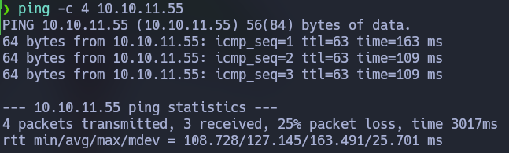

Hacemos un escaner con Nmap para comprobar que puertos estan abiertos y vemos que estan abiertos el 22 y el 80.

`nmap -p- -vvv --open -T5 -Pn -n 10.10.11.55`

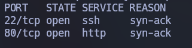

Hacemos otro escaner Nmap en los puertos 22 y 80 para recabar información sobre los servicios que corren.

`nmap -p 22,80 -vvv -sVC -Pn -n 10.10.11.55 -oN scan`

Podemos ver que en el puerto 22 corre un OpenSSH 8.9p1 y en el puerto 80 un Apache httpd 2.4.52 que esta intentando redirigir la conexión a http://titanic.htb/

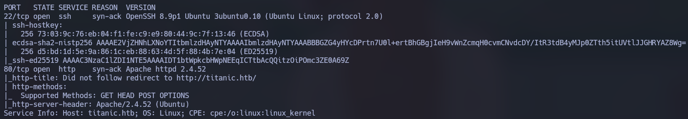

Para poder conectarnos a la ip con el dominio titanic.htb tenemos que escribir el dominio dentro del archivo /etc/hosts con el siguiente comando: 

`echo '10.10.11.55    titanic.htb' >> /etc/hosts`

Despues, he usado el comando `whatweb http://titanic.htb > whatweb | cat` para recabar un poco mas de información sobre la tecnología detrás de la página. Y me doy cuenta de que corre un servicio Werkzeug 3.0.3 por lo que el apache es un proxy inverso.

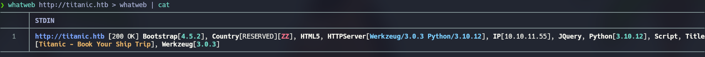

Si nos conectamos a la página desde el navegador se ve así.
Mirando un poco la página lo unico que funciona es el botón de "Book Your Trip" el cual nos abre un formulario.


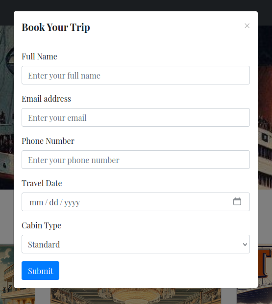

Cuando completamos el formulario se nos descarga un archivo json como este.

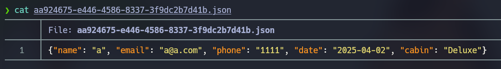

## Enumeración

He interceptado la petición del formulario con Burpsuite para ver si había algín tipo de vulnerabilidad y me he dado cuenta de que despues de la petición POST del formulario redirige al directorio /download?ticket el cual carga el archivo .json. He probado con la petición /download?ticket=../../../../../../../../../etc/passwd para comprobar si era vulnerable a Local File Inclusion y efectivamente ha cargado el archivo /etc/passwd.
Solo hay un usuario que se llama developer.

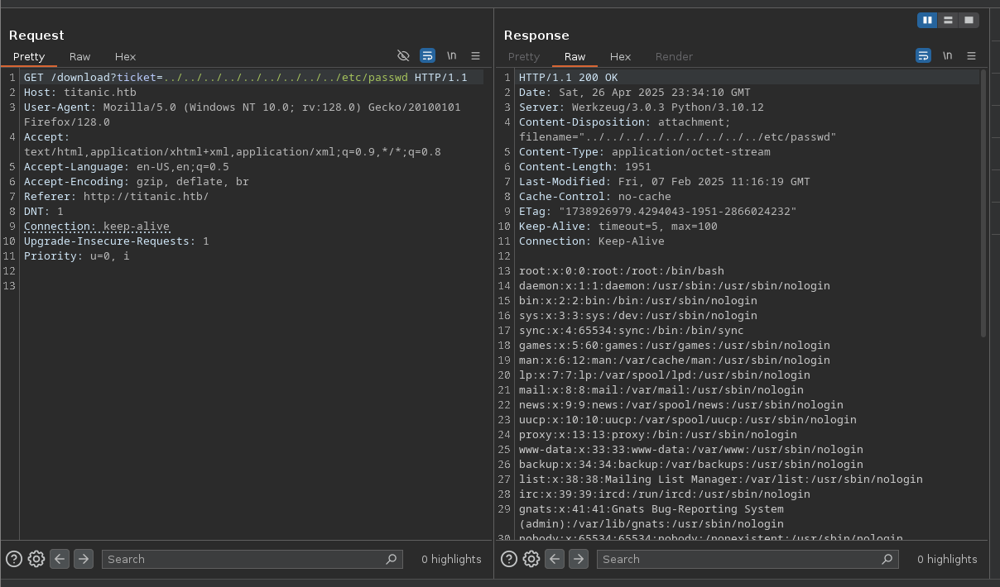

Jugando un poco con esto no he encontrado nada relevante hasta que leyendo el archivo /etc/hosts me he dado cuenta de un subdominio llamado dev.titanic.htb

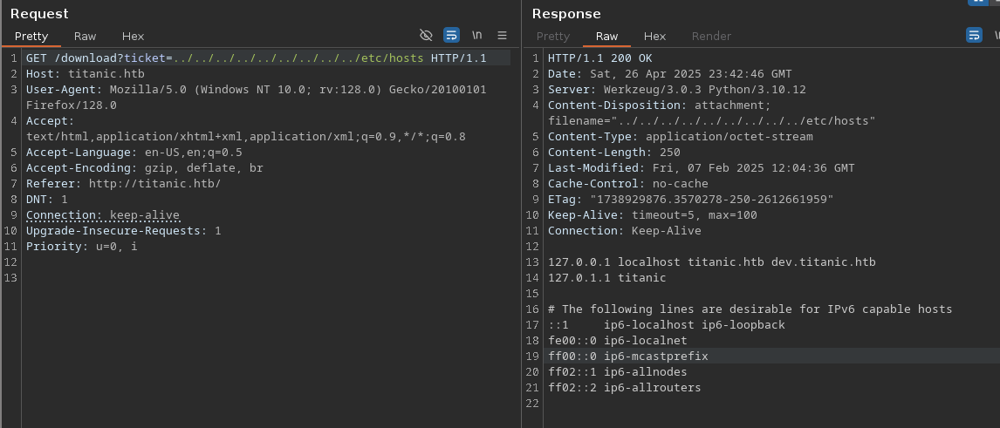

Escribo el dominio dev.titanic.htb en el archivo `/etc/hosts`
Me he conectado a este subdominio con el navegador y he visto que corre un Gitea el cual parece una aplicación de gestión de repositorios de git.

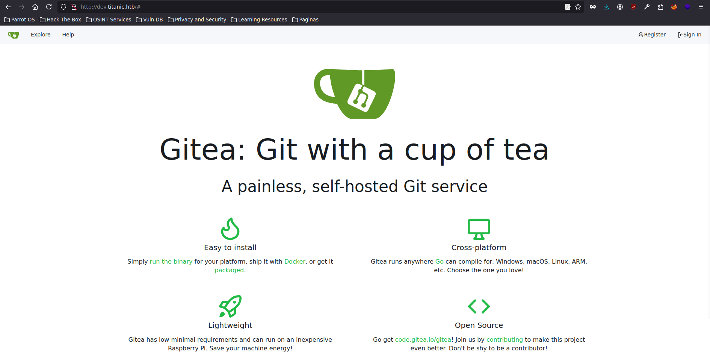

Si nos vamos a "Explore" podemos ver que hay dos repositorios uno llamado docker-config y otro llamado flask-app, nos vamos a centrar en el de docker-config.

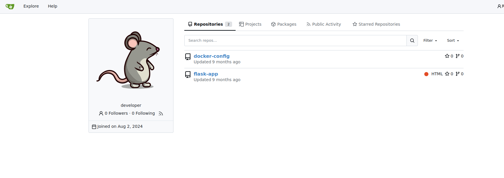

Dentro del repositorio docker-config en la carpeta gitea he podido encontrar un archivo docker-compose.yml para el despliegue de gitea con Docker. Donde pone "volumes" podemos ver la ruta de configuración de gitea, por lo que con una petición usando LFI intentaré leerlo y ver si hay información relevante.

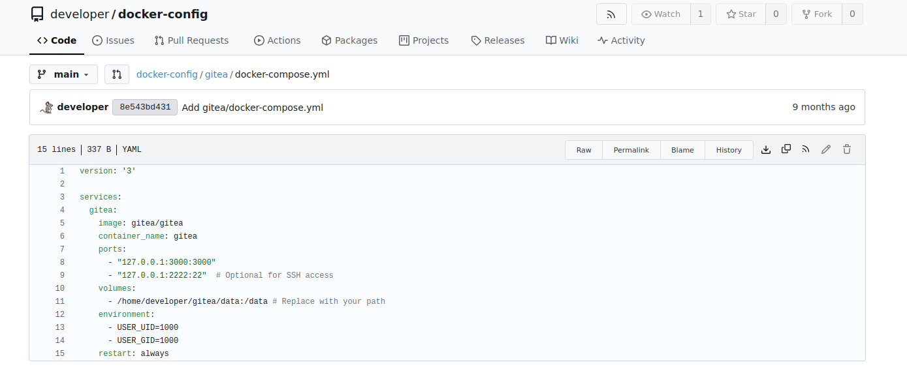

En esta pagina podemos ver la documentación de como desplegar gitea con docker, y podemos ver donde se aloja el archivo de configuración de gitea, en este caso es en `/gitea/conf/app.ini`

https://docs.gitea.com/next/installation/install-with-docker

## Explotación

Por lo que conociendo que la ruta de gitea es `/home/developer/gitea/data` y la ruta del archivo de configuración es `/gitea/conf/app.ini` he hecho una petición con curl.

```
curl "http://titanic.htb/download?ticket=../../../../../../../../../home/developer/gitea/data/gitea/conf/app.ini"
```

Leyendo el archivo de configuración lo unico que he encontrado relevante es la ruta a la base de datos `/data/gitea/gitea.db`

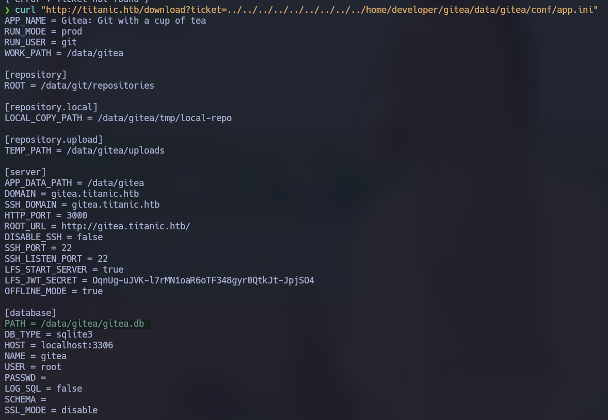

Asi que otra vez con curl ejecuto este comando para guardar la base de datos.

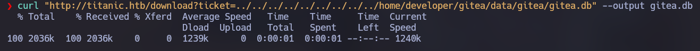

Y en la base de datos pude encontrar las credenciales de los usuarios "administrador" y "developer"

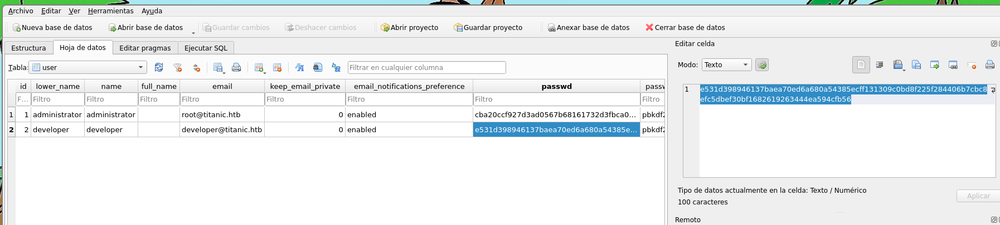

Como están encriptadas he encontrado este script en Python para desencriptar contraseñas de gitea.

https://github.com/dvdknaap/gitea-crack-passwords/blob/main/gitTeaPassCrack.py

He ejecutado el script proporcionando la salt y el hash y me ha salido que la contraseña de developer es `25282528`

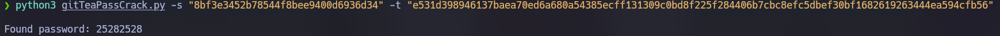

Me conecto a la máquina por ssh proporcionando esa contraseña y obtengo la conexión.

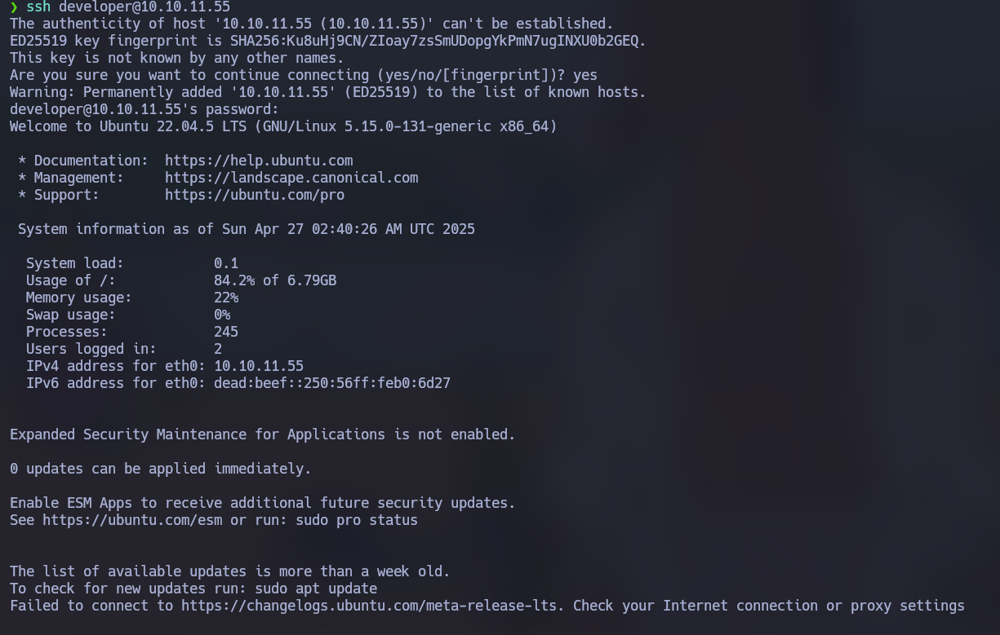

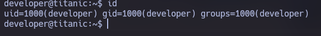

Aqui esta la flag user.txt.

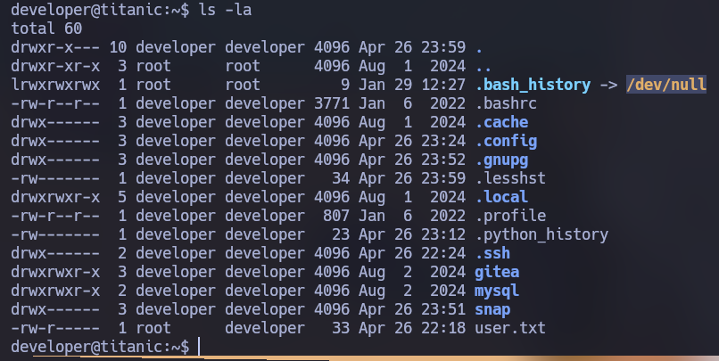

## Escalada de privilegios

Para escalar privilegios ejecuto el comando `sudo -l` para ver si el usuario tiene permisos de sudo y veo que puede ejecutar cualquier comando, por lo que ejecuto `sudo su` y ya soy usuario root.
Entro en /root y aqui esta la flag root.txt.

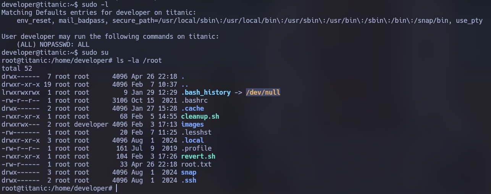